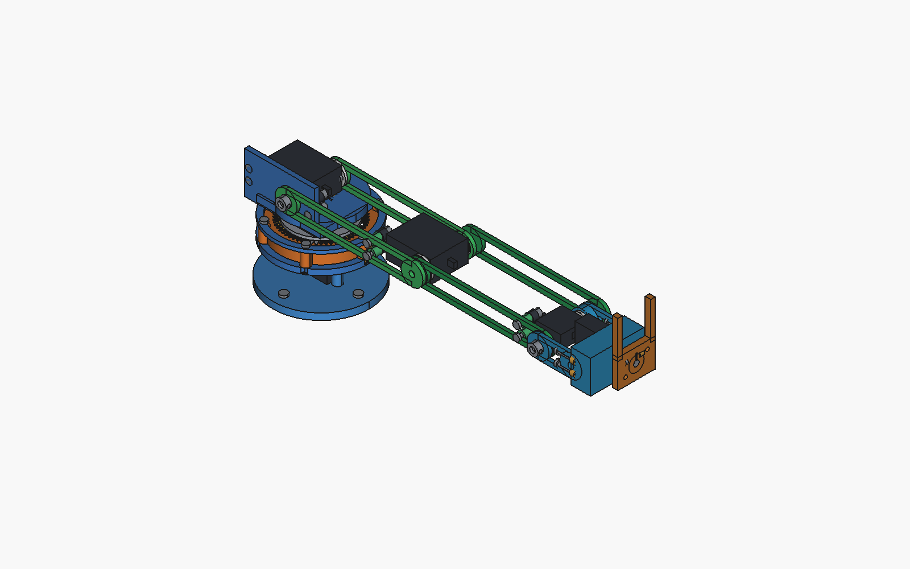

# 6軸 カメラグリッパ・ロボットアーム（パラメトリック設計）

> **FreeCAD + Python による完全パラメトリックな 6 軸アーム。** 1 つのパラメータ表から
> CAD・STL・URDF・2D 図面を生成し、6 種類の自動検証（干渉・可到達範囲・印刷サイズ・
> 締結形状・サーボ駆動・自己干渉）をすべてパスさせています。

[](https://www.python.org/)
[](https://www.freecad.org/)
[](https://pybullet.org/)
[](#検証結果)
[](#生成物)

**English summary** — A fully parametric 6-DOF camera-gripper arm designed in FreeCAD from a
single parameter table, which then generates STL meshes, a URDF model, and 2D drawings.
An automated validation suite checks print-bed size, fastener features, forward-kinematics
reach, collision, servo drive torque, and self-collision — **6/6 passing**.



---

## 仕様

| 項目 | 値 |
|------|-----|
| 自由度 | 6 軸（J1 ヨー / J2 肩 / J3 肘 / J4 手首ピッチ / J5 ロール / J6 ヨー）+ グリッパ + カメラチルト |
| 到達距離（目安） | ~350 mm（上腕 140 + 前腕 120 + 手首 ~70） |
| ペイロード | 先端 100 g |
| サーボ | MG996R ×2（J1/J2）、MG90S ×6（J3–J6・グリッパ・カメラチルト） |
| 軸受 | F695ZZ ×5、F685ZZ ×5（フランジ軸受で径方向荷重を受ける） |
| 印刷制約 | 1 パーツ ≤180 mm（実測最大 129.92 mm） |
| 締結 | **接着禁止** — ねじ・圧入・軸嵌合のみ |

設計根拠は [`docs/design_notes.md`](docs/design_notes.md)、2D 図面は [`docs/2d/`](docs/2d/) を参照。

## 設計方針

実機（OmArm / Omartronics 系）のパターンに合わせ、
**サーボ片側＋対向フランジ軸受＋ホーン締結** を全関節で統一しています。

1. **固定側** — サーボポケット（公開寸法のタブ穴で位置決め）
2. **駆動側** — 円形ホーンをリンクにねじ止め
3. **反対側** — F695 / F685 フランジ軸受座 + Ø5 軸
4. ケーブル通し穴を確保し、分割リンクはダボ + M3 インサートで結合

サーボ出力軸に曲げモーメントを入れない構成にすることで、
MG90S のような小型サーボでも関節を成立させています。

---

## 生成物

`params.py` を唯一の真実源として、FreeCAD 経由で以下を再生成できます。

| 出力 | 内容 |
|------|------|
| `export/stl/` | 印刷用 STL **20 点**（ベース板〜フィンガ） |
| `export/fcstd/RobotArm.FCStd` | FreeCAD アセンブリ |
| `export/vendor/*.step` | サーボ／軸受／ホーンの参照モデル |
| `urdf/robot_arm.urdf` + `urdf/meshes/` | シミュレーション用 URDF |
| `docs/2d/*.svg` | 2D プロファイル **11 点** |

## 生成手順（FreeCAD）

FreeCAD の Python コンソールで、リポジトリの `generate_arm.py` を実行します。

```python
exec(open("generate_arm.py", encoding="utf-8").read())
```

> 絶対パスで実行する場合は、クローンしたディレクトリの `generate_arm.py` を指定してください。

SVG のみ再出力する場合:

```bash
python cad/export_svg.py
```

寸法変更は [`params.py`](params.py) を編集して再生成するだけです。

---

## 検証結果

```bash
py -3.11 tests/run_validation.py
```

結果は `export/validation_report.json` に出力されます。**全 6 項目パス**（`"ok": true`）。

| 検証項目 | 内容 | 結果 |
|----------|------|------|
| `print_size` | 全 STL が印刷ベッド内（最大 129.92 mm） | ✅ |
| `fastener_features` | ねじ穴・インサート座の形状検証 | ✅ |
| `fk_reach` | 順運動学による到達距離 | ✅ |
| `collision` | パーツ間干渉チェック | ✅ |
| `servo_drive` | サーボ駆動トルクの余裕 | ✅ |
| `self_collision_flag` | 自己干渉の判定 | ✅ |

---

## 物理シミュレーション

### PyBullet（GUI 操作デモ）

Python **3.10–3.12** が必要です。

```bash
py -3.11 -m pip install pybullet
py -3.11 sim/pybullet_arm.py
```

または `sim/run_gui.bat`。スライダーで J1–J6・グリッパ・カメラチルトを動かすと、
重力下でアーム全体が追従します。ヘッドレス確認:

```bash
py -3.11 sim/pybullet_arm.py --direct
```

### numpy フォールバック

PyBullet が使えない環境向け。PD サーボ追従＋重力トルクの簡易物理:

```bash
py -3.11 -m pip install numpy matplotlib
py -3.11 sim/numpy_physics_arm.py
# または
py -3.11 sim/numpy_physics_arm.py --no-plot
```

---

## 組立順（概略）

1. ベース板＋カラムに MG996R と F695ZZ → タレット下面軸受・ホーン結合
2. タレット U 頬に F695ZZ ×2 → 肩 MG996R → ホーン／アイドラを上腕へ
3. 上腕分割結合 → 肘 MG90S + F695ZZ
4. 前腕 → 手首ピッチ／ロール／ヨー（F685ZZ）
5. グリッパ → カメラチルト（60×8 基板、Ø6 レンズ逃げ）

締結の詳細は [`bom.md`](bom.md) を参照。

---

## リポジトリ構成

```
params.py            # 寸法パラメータ（唯一の真実源）
generate_arm.py      # FreeCAD 生成スクリプト
cad/                 # 2D スケッチ・押し出し定義
sim/                 # PyBullet / numpy シミュレーション
tests/               # 自動検証スイート
urdf/                # URDF + メッシュ
export/              # 生成物（STL / FCStd / STEP / 検証レポート）
docs/                # 設計ノート・2D 図面
engineering/         # 設計検討の履歴（プレビュー画像を含む）
bom.md               # 部品表・締結仕様
```

## ライセンス

© 2026 Kohaku912. All rights reserved.
